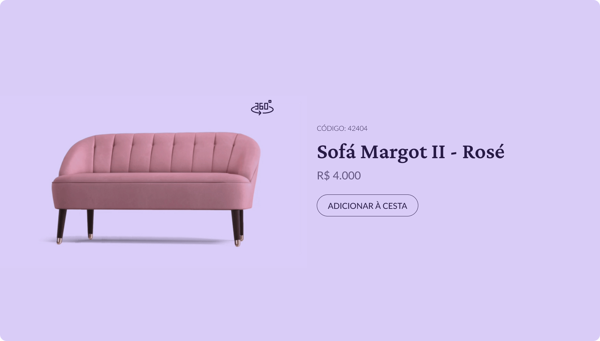

<h1 align="center"> Desafio 02 #boraCodar da RocketSeat </h1>

Projeto do desafio #boraCodar da RocketSeat

  <a href="#-tecnologias">Tecnologias</a>&nbsp;&nbsp;&nbsp;|&nbsp;&nbsp;&nbsp;
  <a href="#-projeto">Projeto</a>&nbsp;&nbsp;&nbsp;|&nbsp;&nbsp;&nbsp;
  <a href="#-layout">Layout</a>&nbsp;&nbsp;&nbsp;|&nbsp;&nbsp;&nbsp;
  <a href="#memo-licença">Licença</a>

  

 

  [Link do Projeto Pronto]()

  

## 🚀 Tecnologias

Esse projeto foi desenvolvido com as seguintes tecnologias:

- HTML
- JavaScript
- [Sass](https://sass-lang.com/)
- [Sweetalert2](https://sweetalert2.github.io/)

## 💻 Projeto

Projeto de desafio era criar um card de produto que ao clicar no botão 360° troca a imagem para um gif que fica girando

## 🔖 Layout

Você pode visualizar o layout do projeto através [DESSE LINK](https://www.figma.com/community/file/1195050984449538256). É necessário ter conta no [Figma](https://figma.com) para acessá-lo.

## :memo: Licença

Esse projeto está sob a licença MIT.

---